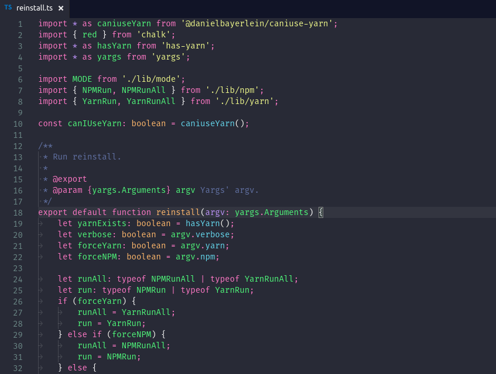

# Ramda Theme for Visual Studio Code

🐏 [Ramda](http://ramdajs.com/) [REPL](http://ramdajs.com/repl/) theme for [Visual Studio Code](https://code.visualstudio.com/).

⏳ WIP ⏳

## Screenshot

